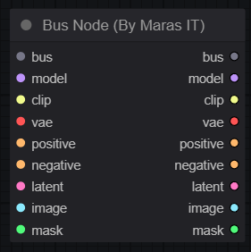

This is a revised version of the Bus node from the [Was Node Suite](https://github.com/WASasquatch/was-node-suite-comfyui) to integrate more input/output. 

Here a very simple workflow

If anybody is interested to use it, I'm following on feature request.
