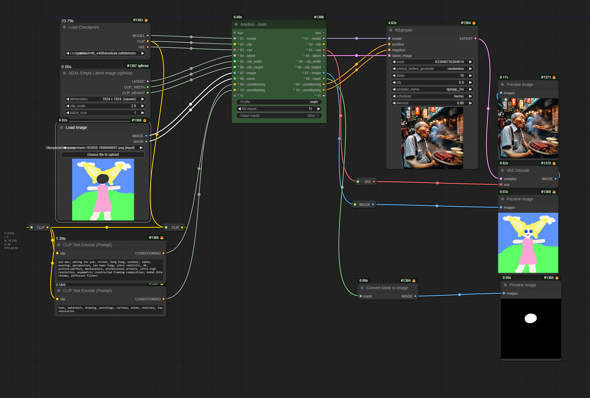

Welcome to MaraScott.AI nodes for ComfyUI.

So far, here is the list of developed nodes:

- [AnyBus Node AKA UniversalBus](#anybus-node-aka-universalbus-node) to easily manage a large number of splines in the workflow.
- [Upscale Refiner Node AKA McBoaty](#upscaler-refiner-node-aka-mcboaty-node) to upscale and refine an image for printing or any other purpose that might require a larger size.
- Display Info to display multiline text

# AnyBus Node AKA UniversalBus Node

The AnyBus Node (AKA UniversalBus Node) is designed to provide a Universal Bus Node (as some might say) based on AnyType Input/Output.

**Native Support**

You can assume that any node input/output works like "UE Nodes / Use Everywhere" Nodes.

**BUS Input/Output Support**

Bus Nodes can be connected from one AnyBus Node to another, and we support the following Reroute Nodes as long as they are linked from an AnyBus Node before connecting it to another.

Set/Get Node **Supported**:

- "SetNode" from ComfyUI-KJNodes
- "GetNode" from ComfyUI-KJNodes

Reroute Node **Supported**:

- "Reroute (rgthree)" from RgThree Custom Node

Reroute Node **Not Supported**:
- "Reroute" from ComfyUI native - reason: does not allow connection on Any Type if the origin Type is not Any Type too
- "ReroutePrimitive|pysssss" from Pysssss Custom Node - reason: does not display the name of the origin slot
- "0246.CastReroute" from 0246 Custom Node - reason: undefined behavior

Here is a very simple workflow:

What does it intend to do?

In the world of ComfyUI, the spaghetti workflow can quickly become a mess. I personally was confused at some point by the get/set approach, which brought me to develop this AnyBus Node applying a profile approach to organize different Buses in the same workflow.
One Bus has a maximum of 25 inputs/outputs (feel free to make an issue request for a higher maximum).

the profile setting :

the BusNode profile is a mecanism to synchronize BusNodes in the samw flow (connected by the Bus input/output) all nodes with the same profile name and connected together will be synchronized if one of them is modified

when adding a node, the profile is default, if you have another flow called main for example and you connect the bus output of the flow to the input of the default busnode, the main flow will synchronize the main input to the default one and change the profile name to main. this works only for default node, if you have a node called TextFlow and try to connect main to TextFlow, the connection will be refused. this allow to have multiple flow in the same workflow and avoid conflict

This AnyBus is dyslexia friendly :D

# Large Upscaler Refiner Node AKA McBoaty Node

The Upscaler Refiner Node (AKA McBoaty Node) is an upscaler coupled with a refiner to achieve higher rendering results.
The output image is a slightly modified image.

**Not Supported**:
- ControlNet : your conditioning needs to be ControlNet Free  

# Prompt From Image Node AKA McPrompty Node

The Prompt From Image Node (AKA McPrompty Node) is a prompt generator node using an image as input coupled with llm engine (Grok) to generate the text.
The output text can be used as prompt afterwards.

# Thanks

## Special thanks

I would like to thank my [AI Classroom Discord](discord.gg/t28yZEewrp) buddies with a shoutout to:
- [@Fern](https://www.youtube.com/@ferniclestix) to whom I address **A special thanks for his support** in my ComfyUI journey who accepted me in his discord in the first place and tried to put good ideas in my head

## Node related thanks

### AnyBus

I would like to thank the following people for helping me out by providing their awesome code and advice on the AnyBus node:
- Confyanimous with his [ComfyUI](https://github.com/comfyanonymous/ComfyUI)
- DrLtData with his [Custom nodes Manager](https://github.com/ltdrdata/ComfyUI-Manager), 
- WASasquatch with his [Was Node Suite](https://github.com/WASasquatch/was-node-suite-comfyui)
- KJNodes with his [Get/Set nodes](https://github.com/kijai/ComfyUI-KJNodes), 
- Trung0246 with his [Highway node](https://github.com/Trung0246/ComfyUI-0246), 
- Jags with his [support](https://www.youtube.com/channel/UCLXyz7oWNKx-Dp7Ba4v5ZZg)

### Large Upscaler Refiner

I would like to thank 
- [Rob Adams](https://www.youtube.com/@robadams2451) AKA Treeshark who provided the workflow in the first place which I converted into a ComfyUI Node, you can find his original workflow presentation in his YouTube video: [Advanced UpScaling in ComfyUI](https://www.youtube.com/watch?v=HStp7u682mE)
- [@YouFunnyGuys](discord.gg/t28yZEewrp) From the discord channel for his invaluable contribution and exceptional testing skills

*I might have forgotten some other people, please contact me if you want to appear here and please forgive me.*

---

If anybody is interested in using these nodes, I'm following up on feature requests via the issues.
If you have Node ideas, feel free to make a request in the issues.
